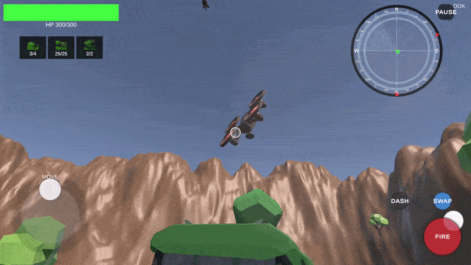
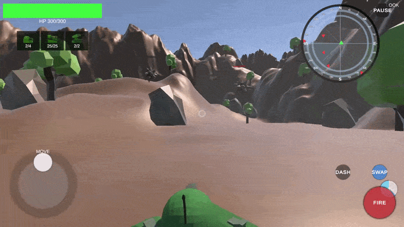
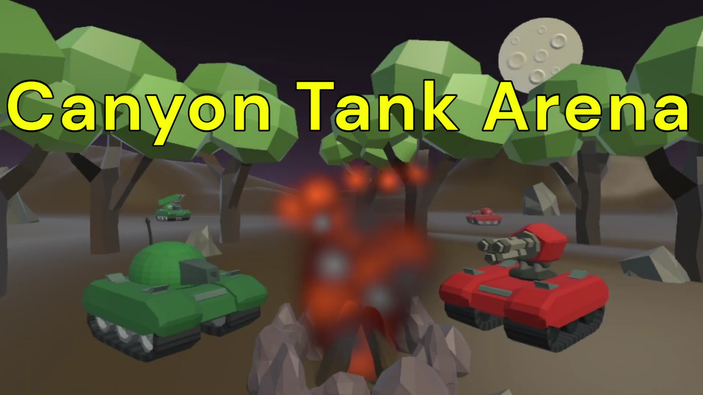

<div align="center">

# 🪖 Canyon Tank Arena

**Wave survival in a canyon arena. Fight off tanks, drones, and spikeballs across escalating waves.**






[▶ Play on itch.io](https://creatorofstories.itch.io/canyon-tank-arena) &nbsp;•&nbsp; [📱 Download APK](https://github.com/alexander89162/CanyonTankArena/releases/tag/v0.1-alpha)

</div>


## Purpose

Canyon Tank Arena was built as a learning experience — our first shipped game, successfully running on both WebGL and Android. The goal was to go through the full cycle of building, debugging, and deploying a real game to multiple platforms.

---

## Features

- **Multi-platform JSON parsing** — wave definitions and scripted drone flight paths loaded at runtime via `UnityWebRequest`, compatible with both WebGL and Android
- **Drone scheduler** — drones follow scripted entry and exit paths with event-driven rerouting mid-wave
- **State-driven wave system** — sequential and procedural wave modes, each with full allocation, queuing, and deallocation lifecycle
- **Enemy AI** — state-machine-driven tank and spikeball behavior
- **Weapon system** — multiple weapons that can be swapped seamlessly, each handling its own internal state and animated procedurally
- **Tech tree** — persistent upgrades that carry over between sessions
- **Persistent player progress** — save system backed by IndexedDB on WebGL and standard file I/O on Android

---

## 🗺️ Adding Your Own Content</summary>

The game was designed to make adding new content straightforward. All wave and drone data is defined in JSON files under `StreamingAssets/`. This means the waves and drones the player faces can be changed freely by just changing the JSON files, no code changes needed.

**Adding a new wave**

Create a new file in `StreamingAssets/Waves/YourMap/` named `wave1.json`, `wave2.json`, etc. Then create a `waveconfig.json` in the same folder to define the wave order and mode.

<details>
<summary>wave JSON example</summary>

```json
{
  "unitConfigs": [
    {
      "prefabName": "tank-cannon",
      "spawnDelay": 2.0,
      "spawnPointId": 1,
      "team": 1,
      "damageMultiplier": 1.0,
      "healthMultiplier": 1.0,
      "movementSpeed": 1.0
    }
  ],
  "droneConfigs": [],
  "droneEvents": []
}
```

```json
{
  "waveMode": "sequential",
  "startWave": "wave1",
  "transitions": []
}
```

</details>

**Adding a drone path**

Drone flight paths live in `StreamingAssets/DroneActions/`. Each file defines a series of waypoints the drone follows. Reference the file by name (without `.json`) in your wave's `droneConfigs` array.

<details>
<summary>drone path JSON example</summary>

```json
{
  "movements": [
    { "moveId": 1, "position": { "x": 0, "y": 50, "z": 0 }, "rotation": { "x": 0, "y": 0, "z": 0 }, "endVelocity": 30.0, "accelerationType": "QuadraticDecreasing", "rotationType": "Slerp" },
    { "moveId": 2, "position": { "x": 100, "y": 30, "z": 50 }, "rotation": { "x": 0, "y": 45, "z": 0 }, "endVelocity": 0.0, "accelerationType": "QuadraticDecreasing", "rotationType": "Slerp" }
  ],
  "brakingManeuvers": [],
  "deploymentActions": []
}
```

</details>

---

## The Team 🤝

I couldn't have done it without the team — here are some of each member's biggest contributions:

[**Leo**](https://github.com/Lgranad13): Tech tree and persistent saving of account progression  
[**Huy**](https://github.com/HuyLam2004): Mobile touch controls and the dash function  
**Alexander**: State-driven enemies and robust weapon system
